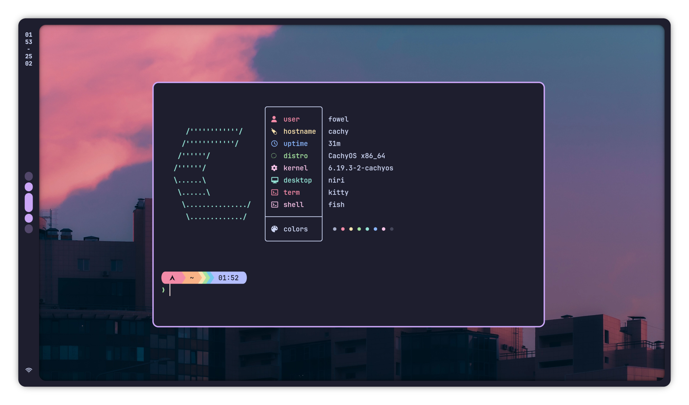
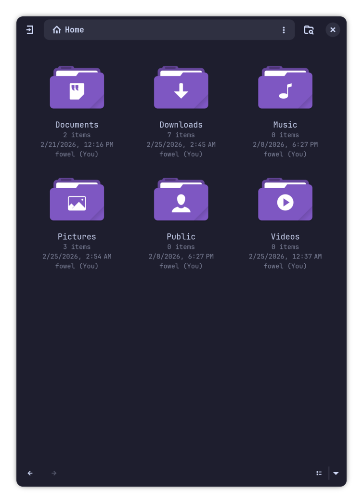
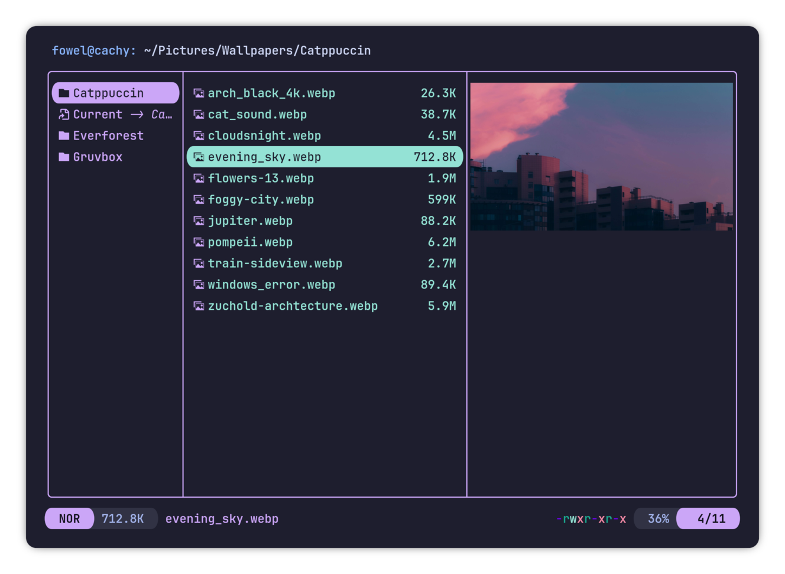
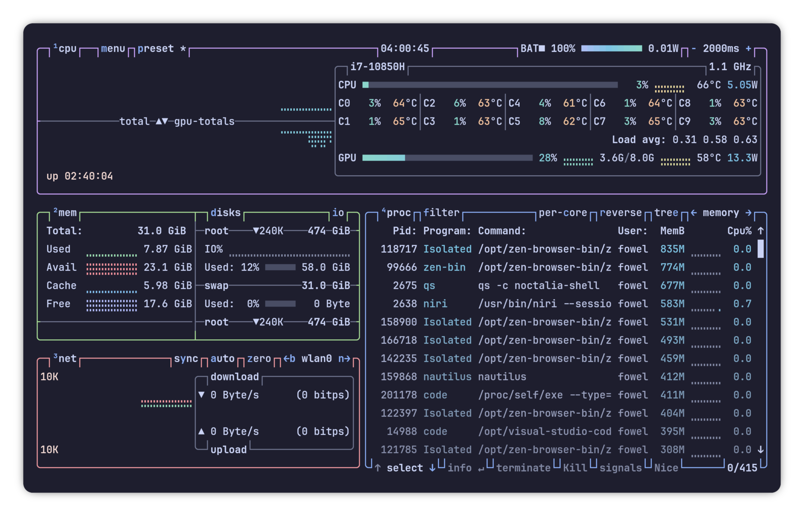

<h1 align="center"><strong>Niri ● files</strong></h1>
&nbsp;

<i>My daily drive <strong>Niri</strong> dotfiles. Minimal, aesthetic and avoid config overhead.</i>

&nbsp;

&nbsp;

<h3 align="center">_ SCREENSHOT _</h3> 

<table>
<tr>
<td colspan="2" valign="top" width="52%">
    
    
Fullscreen
 
</td>
</tr>
<tr>
<td valign="top" width="52%">
    
    
File Manager (Nautilus)

</td>
<td valign="top">
    
    
Terminal File Manager (Yazi)

    
    
System Monitor (btop)

</td>
</table>

<i>And more...</i>

&nbsp;

&nbsp;

<h3 align="center">_ OVERVIEW _</h3>

#### System

- Distro: [**CachyOS**](https://cachyos.org/)
- Window Manager: [**Niri**](https://github.com/YaLTeR/niri) `niri`
- Desktop Shell: [**Noctalia**](https://docs.noctalia.dev/getting-started/installation/) `noctalia-shell`
- Screenlock: [**hyprlock**](https://wiki.hypr.land/Hypr-Ecosystem/hyprlock/) `hyprlock`
- Polkit: `polkit-gnome`
- Plymouth: `plymouth-theme-bgrt-no-watermark`
- Display Manager: `gdm`

#### Applications

- Shell: [**fish**](https://fishshell.com/docs/current/) `fish`
- Terminal: [**Kitty**](https://sw.kovidgoyal.net/kitty/) `kitty`
- Powerline: [**Starship**](https://starship.rs/) `starship`
- File Manager: [**Yazi**](https://yazi-rs.github.io/) `yazi`
- Code Editor: [**Visual Studio Code**](https://code.visualstudio.com/) `visual-studio-code-bin`, [**Neovim**](https://neovim.io/) `neovim`
- Browser: [**Zen Browser**](https://zen-browser.app/) `zen-browser-bin`, [**Google Chrome**](https://www.google.com/chrome/) `google-chrome`
- Image Viewer: **qimgv** `qimgv-qt6-kde-git`
- Video Player: **GNOME Showtime** `showtime`
- System Monitor: [**btop**](https://github.com/aristocratos/btop) `btop`
- Discord Client: [**Vesktop**](https://vesktop.dev/) `vesktop`

#### Others

- Password Manager: `bitwarden`
- Fonts: `ttf-jetbrains-mono` `ttf-jetbrains-mono-nerd`
- Full Icon Theme: `tela-circle-icon-theme-purple`
- Mouse Cursor: `googledot-cursor-theme`
- Input: `fcitx5` `fcitx5-configtool` `fcitx5-unikey` `catppuccin-fcitx5-git`
- `chaotic-aur`: Prebuild AUR packages
- `gnome-tweaks`: GUI for some tweaks
