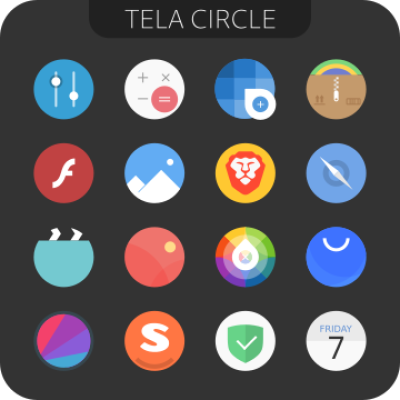

<h1 align="center">
     
    <strong>Niri⚬files</strong>
</h1>
&nbsp;

<i>My daily drive Niri dotfiles. Minimal, aesthetic and avoid overhead.</i>

&nbsp;

&nbsp;

<h3 align="center">_ SCREENSHOT _</h3> 

<table>

<tr>
    <td colspan="2" valign="top" width="52%">
        
        
Fullscreen
 
    </td>
</tr>

<tr>
    <td valign="top" width="52%">
        
        
File Manager (Nautilus)

    </td>
    <td valign="top">
        
        
Terminal File Manager (Yazi)

        
        
System Monitor (btop)

    </td>
</tr>

</table>

 

<i>And more...</i>

&nbsp;

&nbsp;

<h3 align="center">_ OVERVIEW _</h3>

&nbsp;

<table align="center">

<tr>
    <th colspan="3">
        
System

    </th>
</tr>

<tr align="center">
    <td>
        Distro
    </td>
    <td>
        Window Manager
    </td>
    <td>
        Desktop Shell
    </td>
</tr>

<tr>
    <td align="center">
         
        <a href="https://cachyos.org/">CachyOS</a>
    </td>
    <td align="center">
         
        <a href="https://github.com/niri-wm/niri">niri</a>
    </td>
    <td align="center">
         
        <a href="https://docs.noctalia.dev/getting-started/installation/">Noctalia</a>
    </td>
</tr>

</table>

&nbsp;

<table align="center">

<tr>
    <th colspan="3">
        
App

    </th>
</tr>

<tr align="center">
    <td>
        Terminal
    </td>
    <td>
        File Manager
    </td>
    <td>
        Browser
    </td>
</tr>

<tr>
    <td align="center">
         
        <a href="https://sw.kovidgoyal.net/kitty/">kitty</a>
    </td>
    <td align="center">
         
        <a href="https://yazi-rs.github.io/">Yazi</a>
    </td>
    <td align="center">
         
        <a href="https://zen-browser.app/">Zen Browser</a>
    </td>
</tr>

</table>

&nbsp;

<table align="center">

<tr>
    <th colspan="4">
        
UI Choice

    </th>
</tr>

<tr align="center">
    <td>
        Color Theme
    </td>
    <td>
        Icons
    </td>
    <td>
        Fonts
    </td>
    <td>
        Mouse Cursor
    </td>
</tr>

<tr>
    <td align="center">
         
        <a href="https://catppuccin.com/">Catppuccin</a>
    </td>
    <td align="center">
         
        <a href="https://github.com/vinceliuice/Tela-circle-icon-theme">Tela Circle</a>
    </td>
    <td align="center">
         
        <a href="https://fonts.google.com/specimen/JetBrains+Mono">JetBrains Mono</a>
    </td>
    <td align="center">
         
        <a href="https://github.com/ful1e5/Google_Cursor">GoogleDot</a>
    </td>
</tr>

</table>

&nbsp;

&nbsp;

<h3 align="center">_ CHILL _</h3>

&nbsp;

#### Prepare your coffee ☕

This document try to be beginner friendly. So...

*I assume you are NOT a ***Super-Pro-Max-Mega-Ultimate Arch user***, you mustn't know everything listed here. But at least, you should have a working Arch-based system installed by your self (eg: CachyOS, Manjaro, EndeavourOS...).*

&nbsp;

... to be continued