<h1 align="center">
    <br/>
    <strong>𝓝𝓲𝓻𝓲 ⚬ 𝓯𝓲𝓵𝓮𝓼</strong>
</h1>
&nbsp;

<p align="center"><i>Modern · Clean · Minimal</i></p>

<p align="center">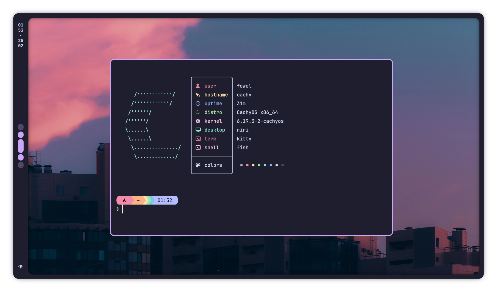</p>

&nbsp;
&nbsp;

<h3 align="center">_ PREVIEW _</h3><br/>

<p align="center">
    <video width="80%" autoplay loop>
        <source src="./assets/vids/Niri Preview 720p.mp4" type="video/mp4" />
    </video>
</p>

&nbsp;

<p align="center">
    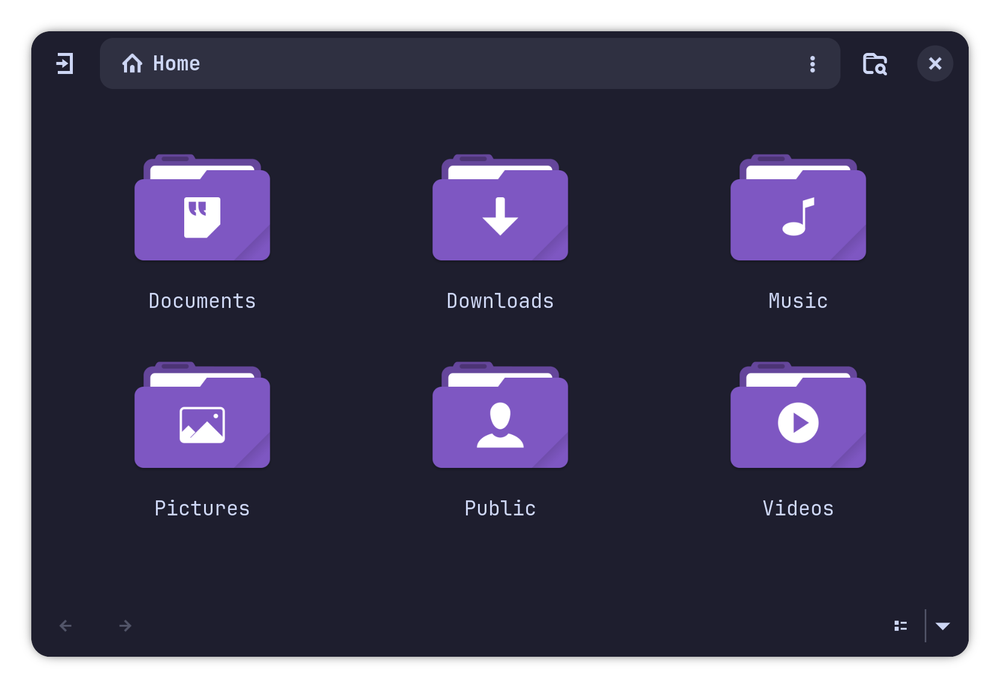</br>
    <sup>File Manager (Nautilus)</sup>
</p>
<p align="center">
    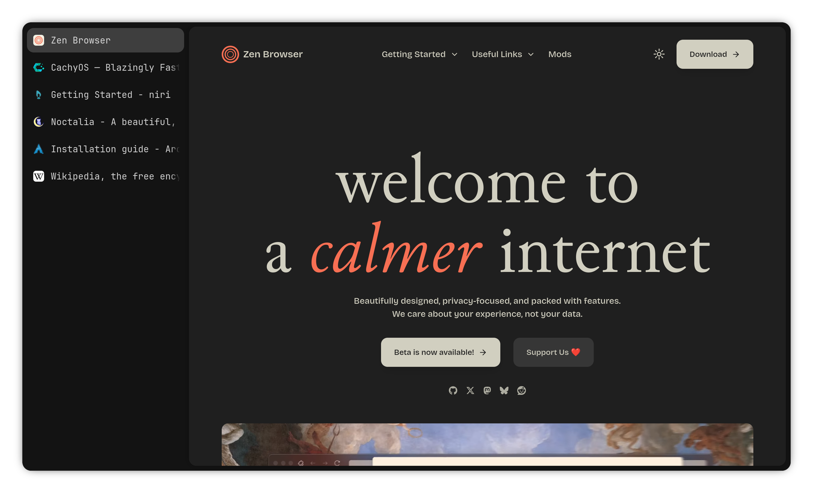</br>
    <sup>Zen Browser</sup>
</p>
<p align="center">
    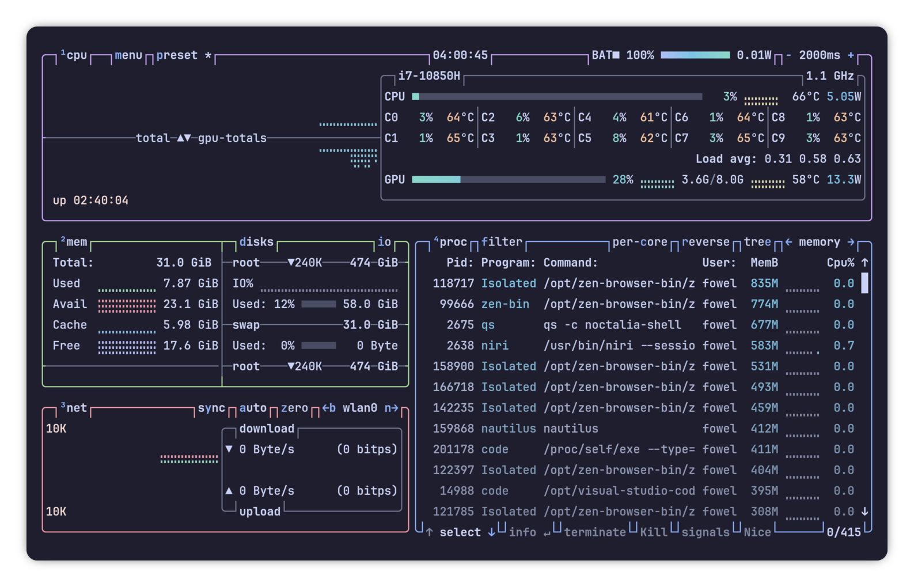</br>
    <sup>System Monitor (btop)</sup>
</p>

&nbsp;
&nbsp;

<h3 align="center">_ OVERVIEW _</h3>

&nbsp;

<table align="center">

<tr>
    <th colspan="99">
        <p align="center">System</p>
    </th>
</tr>

<tr align="center">
    <td>
        Distro
    </td>
    <td>
        Window Manager
    </td>
    <td>
        Desktop Shell
    </td>
</tr>

<tr>
    <td align="center">
        <br/>
        <a href="https://cachyos.org/">CachyOS</a></br>
        <sub>Arch at light speed</sub>
    </td>
    <td align="center">
        <br/>
        <a href="https://github.com/niri-wm/niri">niri</a></br>
        <sub>Infinity space</sub>
    </td>
    <td align="center">
        <br/>
        <a href="https://docs.noctalia.dev/getting-started/installation/">Noctalia</a></br>
        <sub><i>"quiet by design"</i></sub>
    </td>
</tr>

</table>

&nbsp;

<table align="center">

<tr>
    <th colspan="99">
        <p align="center">UI</p>
    </th>
</tr>

<tr align="center">
    <td>
        Color Theme
    </td>
    <td>
        Icons
    </td>
    <td>
        Fonts
    </td>
    <td>
        Mouse Cursor
    </td>
</tr>

<tr>
    <td align="center" valign="top">
        <br/>
        <a href="https://catppuccin.com/">Catppuccin</a></br>
        <sub>Chill!</sub>
    </td>
    <td align="center" valign="top">
        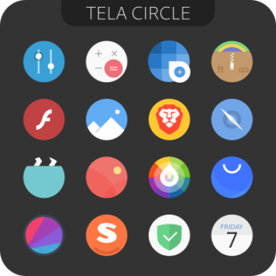<br/>
        <a href="https://github.com/vinceliuice/Tela-circle-icon-theme">Tela Circle</a></br>
        <sub>Quite nice</sub>
    </td>
    <td align="center" valign="top">
        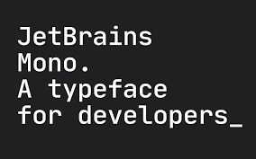<br/>
        <a href="https://fonts.google.com/specimen/JetBrains+Mono">JetBrains Mono</a></br>
        <sub>Best monospace</sub>
    </td>
    <td align="center" valign="top">
        <br/>
        <a href="https://github.com/ful1e5/Google_Cursor">GoogleDot</a></br>
        <sub>It's just circle</sub>
    </td>
</tr>

</table>

&nbsp;

<table align="center">

<tr>
    <th colspan="99">
        <p align="center">Apps</p>
    </th>
</tr>

<tr align="center">
    <td colspan="3">
        Terminal
    </td>
    <td colspan="2">
        File Manager
    </td>
    <td>
        Browser
    </td>
</tr>

<tr>
    <td align="center">
        <br/>
        <a href="https://fishshell.com/docs/current/">fish</a>
    </td>
    <td align="center">
        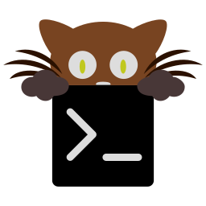<br/>
        <a href="https://sw.kovidgoyal.net/kitty/">kitty</a>
    </td>
    <td align="center">
        <br/>
        <a href="https://starship.rs/">Starship</a>
    </td>
    <td align="center">
        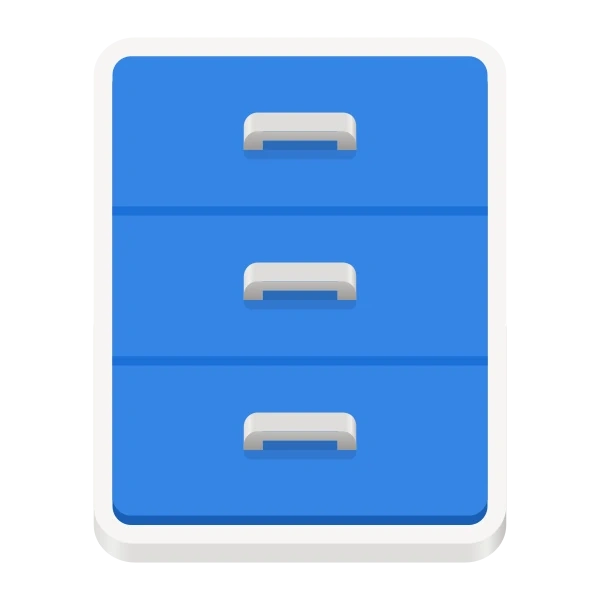<br/>
        <a href="https://yazi-rs.github.io/">Nautilus</a>
    </td>
    <td align="center">
        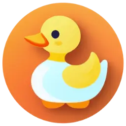<br/>
        <a href="https://yazi-rs.github.io/">Yazi</a>
    </td>
    <td align="center">
        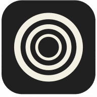<br/>
        <a href="https://zen-browser.app/">Zen Browser</a>
    </td>
</tr>

</table>

&nbsp;

&nbsp;

<h3 align="center">_ SETUP _</h3>

&nbsp;

### 🚀 How to install?

_No. There are no **ALL-IN-ONE** install script._

👇

&nbsp;

#### 🔧 Configs

If you are familar with _dotfiles_ (`~/.config`, `~/.local/bin`...), just clone the repo:

```bash
git clone https://github.com/ForeverWeLearn/niri-dotfiles.git
```

And copy them from `home/.config` to your `~/.config`:

&nbsp;

##### 🔥 niri

`home/.config/niri` -> `~/.config/niri`

&nbsp;

##### 🦉 Noctalia

`home/.config/noctalia` -> `~/.config/noctalia`

&nbsp;

##### 😽 kitty

`home/.config/kitty` -> `~/.config/kitty`

&nbsp;

#### 🖼️ Wallpapers

`home/Pictures/Wallpapers`

<table>

<tr>
    <th colspan="99"><p align="center">Catppuccin</p></th>
</tr>

<tr>
    <td>
        
    <td/>
    <td>
        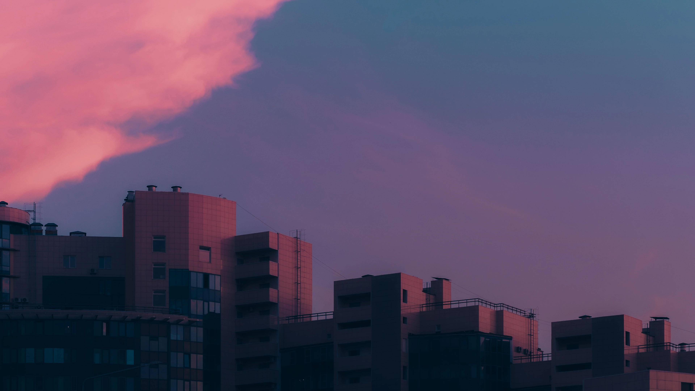
    </td>
    <td>
        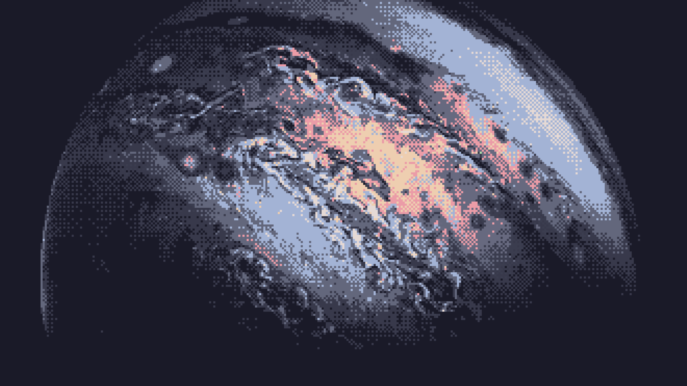
    </td>
</tr>

</table>

&nbsp;

#### 😹 Stuffs

Custom scripts: `home/.local/bin`

##### 🎨 `theme`

Choose between **Catppuccin** and **Gruvbox** theme.

##### ✨ `anime`

Change _niri_ animations
